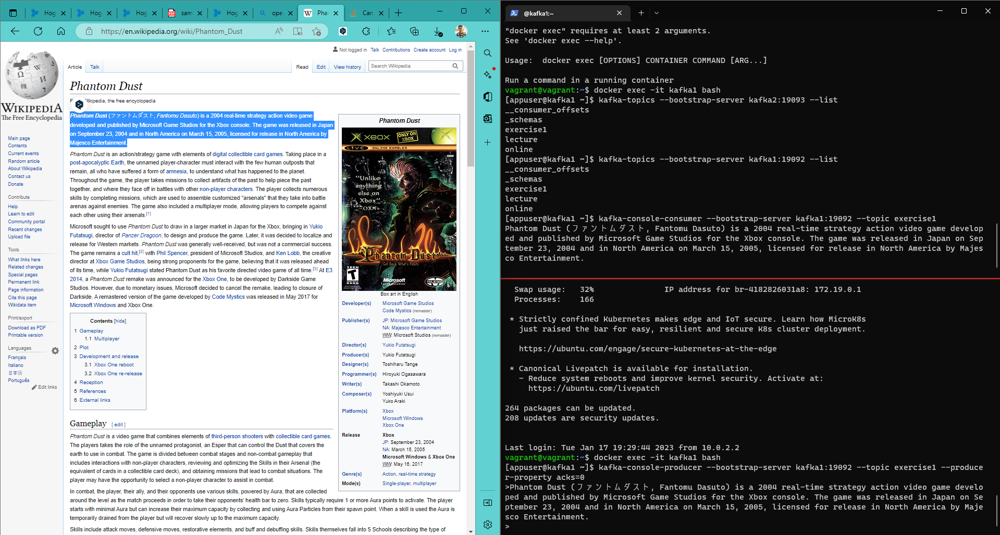
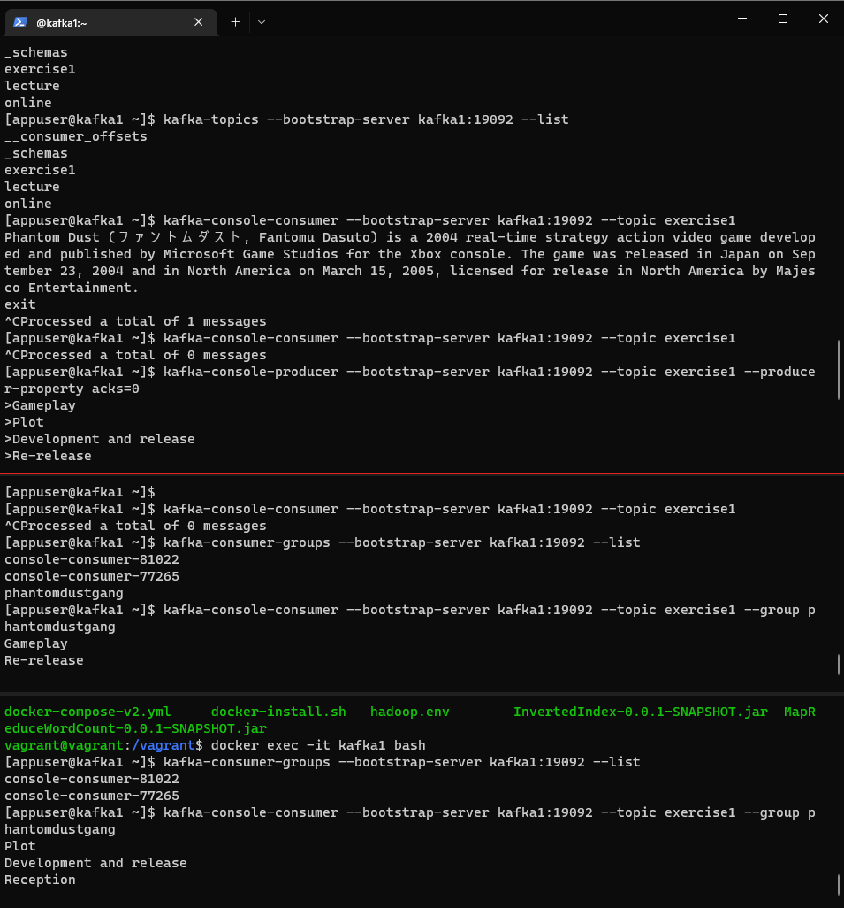
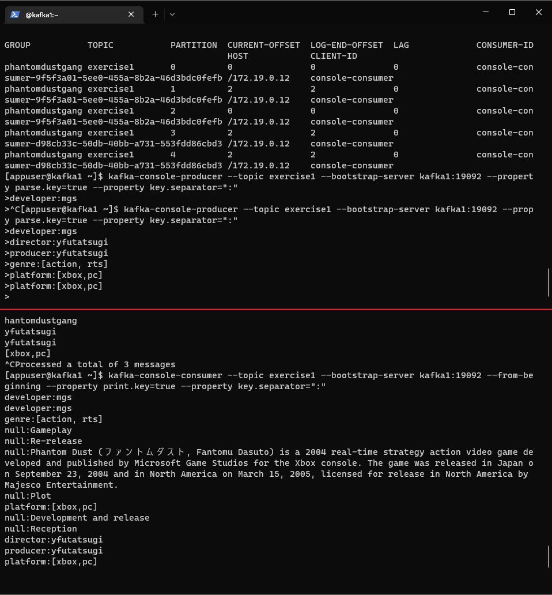

# CLI-oefening

De Kafka-container opstarten doe je met dit commando. De broker-keuze maakt niet uit, want ze hebben allemaal toegang tot dezelfde en alle nabije clusters.

Voor het labo kan je twee PowerShell-schermen gebruiken. Een scherm opsplitsen doe je met: ``Alt``+``Shift``+``-``. Met ``Shift``+``Ctrl``+``W`` sluit het tweede scherm.

```console
docker compose -f docker-kafka.yml up -d
docker exec -it kafka1 bash
```

Use kafka-topics to create a new topic with 5 partitions and a replication factor of 3.

```console
[appuser@kafka1 ~]$ kafka-topics --bootstrap-server localhost:9092 --create --topic exercise1 --partitions 5 --replication-factor 3
Created topic exercise1.
```

Use kafka-console-producer to send some messages to this topic.

*Hieronder maak ik een producer aan die niet wacht op acknowledgement. De andere acks-opties waren ``1`` of ``all``.*

```console
vagrant@vagrant:~$ docker exec -it kafka1 bash
[appuser@kafka1 ~]$ kafka-console-producer --bootstrap-server kafka1:19092 --topic exercise1 --producer-property acks=0
>Phantom Dust (ファントムダスト, Fantomu Dasuto) is a 2004 real-time strategy action video game developed and published by Microsoft Game Studios for the Xbox console. The game was released in Japan on September 23, 2004 and in North America on March 15, 2005, licensed for release in North America by Majesco Entertainment.
```

Use kafka-console-consumer to read these messages.

```console
[appuser@kafka1 ~]$ kafka-console-consumer --bootstrap-server kafka1:19092 --topic exercise1
Phantom Dust (ファントムダスト, Fantomu Dasuto) is a 2004 real-time strategy action video game developed and published by Microsoft Game Studios for the Xbox console. The game was released in Japan on September 23, 2004 and in North America on March 15, 2005, licensed for release in North America by Majesco Entertainment.
```



Use kafka-console-consumer to create two consumers that are part of the same consumer group. Notice how each of these two consumers receives only part of the messages.

Allereerst maak ik een nieuwe groep aan. Hiervoor hoef ik niets impliciet aan te spreken. Dit gebeurt dynamisch wanneer Kafka een nieuwe consumer-group herkent.

```console
[appuser@kafka1 ~]$ kafka-console-consumer --bootstrap-server kafka1:19092 --topic exercise1 --group phantomdustgang

[appuser@kafka1 ~]$ kafka-consumer-groups --bootstrap-server kafka1:19092 --list
console-consumer-81022
console-consumer-77265
phantomdustgang
```

Nu zal ik enkele titels met de producer in het systeem steken. De data wordt evenwaardig verdeeld over de consumers heen.

Producer:

```latex
[appuser@kafka1 ~]$ kafka-console-producer --bootstrap-server kafka1:19092 --topic exercise1 --producer-property acks=0
>Gameplay                   % C1
>Plot                       % C2
>Development and release    % C2
>Re-release                 % C1
>Reception                  % C2
```

Consumer 1:
```console
[appuser@kafka1 ~]$ kafka-console-consumer --bootstrap-server kafka1:19092 --topic exercise1 --group phantomdustgang
Gameplay
Re-release
```

Consumer 2:

```console
[appuser@kafka1 ~]$ kafka-console-consumer --bootstrap-server kafka1:19092 --topic exercise1 --group phantomdustgang
Plot
Development and release
Reception
```

Use kafka-consumer-groups to investigate the consumer group that you created.

```console
[appuser@kafka1 ~]$ kafka-consumer-groups --bootstrap-server kafka1:19092 --describe --group phantomdustgang

GROUP           TOPIC           PARTITION  CURRENT-OFFSET  LOG-END-OFFSET  LAG             CONSUMER-ID                                           HOST            CLIENT-ID
phantomdustgang exercise1       0          0               0               0               console-consumer-0cafb507-7cf4-4f1a-ac35-6c8611e6464c /172.19.0.12    console-consumer
phantomdustgang exercise1       1          2               2               0               console-consumer-0cafb507-7cf4-4f1a-ac35-6c8611e6464c /172.19.0.12    console-consumer
phantomdustgang exercise1       2          0               0               0               console-consumer-0cafb507-7cf4-4f1a-ac35-6c8611e6464c /172.19.0.12    console-consumer
phantomdustgang exercise1       3          2               2               0               console-consumer-a884c76b-5d8f-4365-8c67-ad4e21c127ed /172.19.0.12    console-consumer
phantomdustgang exercise1       4          2               2               0               console-consumer-a884c76b-5d8f-4365-8c67-ad4e21c127ed /172.19.0.12    console-consumer
```

Use kafka-consumer-groups to reset the offsets and notice how you will reread some messages.

Eerst krijg ik een foutmelding, want de twee consumers runnen nog. Deze moeten stoppen met het lezen van de topic.

```console
[appuser@kafka1 ~]$ kafka-consumer-groups --bootstrap-server kafka1:19092 --group phantomdustgang --reset-offsets --to-earliest --execute --topic exercise1
Error: Assignments can only be reset if the group 'phantomdustgang' is inactive, but the current state is Stable.
```

Ik stop de consumers met het laten lezen. De offsets worden nu terug op nul geplaatst. Dit komt omdat ik daarnet ``to-earliest`` meegaf als parameter. 

```console
[appuser@kafka1 ~]$ kafka-consumer-groups --bootstrap-server kafka1:19092 --group phantomdustgang --reset-offsets --to-earliest --execute --topic exercise1

GROUP                          TOPIC                          PARTITION  NEW-OFFSET
phantomdustgang                exercise1                      3          0
phantomdustgang                exercise1                      4          0
phantomdustgang                exercise1                      2          0
phantomdustgang                exercise1                      0          0
phantomdustgang                exercise1                      1          0
```

Als ik nu de consumers weer laat lezen, dan krijgen de consumers deze waarden terug.

Consumer 1:

```console
[appuser@kafka1 ~]$ kafka-console-consumer --bootstrap-server kafka1:19092 --topic exercise1 --group phantomdustgang
Gameplay
Re-release
Phantom Dust (ファントムダスト, Fantomu Dasuto) is a 2004 real-time strategy action video game developed and published by Microsoft Game Studios for the Xbox console. The game was released in Japan on September 23, 2004 and in North America on March 15, 2005, licensed for release in North America by Majesco Entertainment.
Plot
Development and release
Reception
```

Consumer 2: 

```console
[appuser@kafka1 ~]$ kafka-console-consumer --bootstrap-server kafka1:19092 --topic exercise1 --group phantomdustgang
```



Groep-describe

```console
[appuser@kafka1 ~]$ kafka-consumer-groups --bootstrap-server kafka1:19092 --describe --group phantomdustgang

GROUP           TOPIC           PARTITION  CURRENT-OFFSET  LOG-END-OFFSET  LAG             CONSUMER-ID                                           HOST            CLIENT-ID
phantomdustgang exercise1       0          0               0               0               console-consumer-9f5f3a01-5ee0-455a-8b2a-46d3bdc0fefb /172.19.0.12    console-consumer
phantomdustgang exercise1       1          2               2               0               console-consumer-9f5f3a01-5ee0-455a-8b2a-46d3bdc0fefb /172.19.0.12    console-consumer
phantomdustgang exercise1       2          0               0               0               console-consumer-9f5f3a01-5ee0-455a-8b2a-46d3bdc0fefb /172.19.0.12    console-consumer
phantomdustgang exercise1       3          2               2               0               console-consumer-d98cb33c-50db-40bb-a731-553fdd86cbd3 /172.19.0.12    console-consumer
phantomdustgang exercise1       4          2               2               0               console-consumer-d98cb33c-50db-40bb-a731-553fdd86cbd3 /172.19.0.12    console-consumer
[appuser@kafka1 ~]$
```

Figure out how you can send messages containing a key and a value using kafka-console-producer.

```latex
[appuser@kafka1 ~]$ kafka-console-producer --topic exercise1 --bootstrap-server kafka1:19092 --property parse.key=true --property key.separator=":"
>developer:mgs          % c1
>director:yfutatsugi    % c2
>producer:yfutatsugi    % c2
>genre:[action, rts]    % c1
>platform:[xbox,pc]     % c2
```

Het resultaat bij de consumer ziet er dan zo uit, als je géén extra opties meegeeft.

Consumer 1

```console
[appuser@kafka1 ~]$ kafka-console-consumer --bootstrap-server kafka1:19092 --topic exercise1 --group phantomdustgang
mgs
[action, rts]
```

Verify that a key and a value were sent using kafka-console-consumer.

```console
[appuser@kafka1 ~]$ kafka-console-consumer --bootstrap-server kafka1:19092 --topic exercise1 --group phantomdustgang
yfutatsugi
yfutatsugi
[xbox,pc]
```


Je kan echter een optie meegeven, zo toon je wél de key-value paren. Alles wordt van de allereerste offset uitgelezen. Merk op dat alles in een willekeurige volgorde wordt getoond.

```console
[appuser@kafka1 ~]$ kafka-console-consumer --topic exercise1 --bootstrap-server kafka1:19092 --from-be
ginning --property print.key=true --property key.separator=":"
developer:mgs
developer:mgs
genre:[action, rts]
null:Gameplay
null:Re-release
null:Phantom Dust (ファントムダスト, Fantomu Dasuto) is a 2004 real-time strategy action video game developed and published by Microsoft Game Studios for the Xbox console. The game was released in Japan on September 23, 2004 and in North America on March 15, 2005, licensed for release in North America by Majesco Entertainment.
null:Plot
platform:[xbox,pc]
null:Development and release
null:Reception
director:yfutatsugi
producer:yfutatsugi
platform:[xbox,pc]
```

