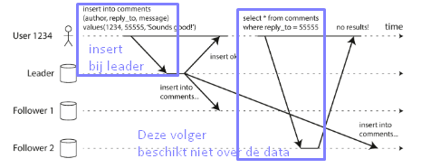
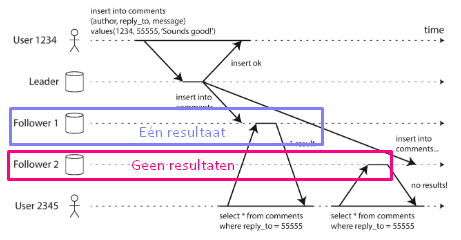
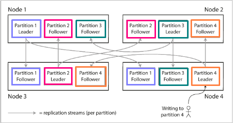
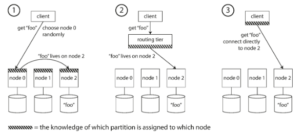
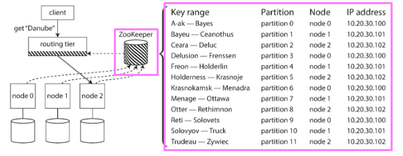

extra: font-options aanpassen https://tex.stackexchange.com/questions/234786/how-to-set-a-font-family-with-pandoc

# 1. Een distributed database.

## Wat?
* Verschillende componenten op een netwerk die met elkaar communiceren.
* Een systeem met het doel om data beschikbaar te maken. Data dat later kan worden gelezen of geschreven.
  * De mate van beschikbaarheid doet er niet toe.

## Waarom?

| Horizontale schaalbaarheid | Verticale schaalbaarheid |
| -- | -- |
| Meer onderdelen toevoegen. | Meer capaciteit toevoegen aan een onderdeel. |

* Moore's law: Het aantal transistoren verdubbelt per achttien maanden. Met andere woorden is er een snelle nood aan nieuwe hardwarematerialen.
* Fouttolerantie toelaten --> Je moet de taken onderling verdelen.
* Latency verminderen --> Kies voor een systeem dat dichter bij de client ligt. Bijvoorbeeld online gameservers zijn opgedeeld per regio's.

## Kenmerken

| _-*-_ | _-*-_ |
| -- | -- |
| Geen gedeeld geheugen. Iedere verwerkingseenheid heeft een eigen geheugen. | Onderling worden er berichten naar elkaar gestuurd. |
| Componenten zijn niet bewust van wat de andere componenten nu aan het doen zijn. | Fouttolerant |

## Soorten systemen

We spreken van twee verschillende soorten systemen: parallele en gedistribueerde systemen.

Een parallel systeem bevat verschillende verwerkingseenheden met een gedeeld geheugen. Het is makkelijker te ontwikkelen, maar met de kost van géén redundantie.

Een gedistribueerd systeem bevat verschillende verwerkingseenheden met elk een eigen geheugen. De andere componenten zijn onbewust van wat de andere onderdelen aan het doen zijn. Er wordt onderling berichten met elkaar verstuurd. Dit noemt ook een shared-nothing architecture: Er wordt niets onderling gedeeld. De enige manier van communicatie is door middel van boodschappen.

| Parallel systeem | Gedistribueerd systeem |
| -- | -- |
| Verschillende verwerkingseenheden met een **gedeeld geheugen**.  | Verschillende verwerkingseenheden met **elk een eigen geheugen**. 
| Makkelijker te ontwikkelen is. | De andere componenten zijn **onbewust** van wat de andere onderdelen aan het doen zijn. Er wordt **onderling berichten** met elkaar verstuurd. |
| Het probleem is dat het systeem **geen redundantie** biedt. | **Shared-nothing architecture:**  Niets wordt onderling gedeeld. De enige manier van communicatie is door middel van boodschappen. |

## CAP-Theorem:

Een theorie dat zegt wanneer een partitioneringsfout voorkomt, het systeem ofwel beschikbaar is ofwel zich in een consistente staat bevindt. De consistency van een relationele databank is véél groter dan de consistency van een gedistribueerde databank. Het is een blijvende afweging tussen consistency en beschikbaarheid.

## Struikelblokken:

Als we werken met een gedistribueerd systeem, dan zijn er vier horden waarmee we rekening moeten houden:
* Split-brain scenario: de ene helft denkt het ene en de andere helft denkt het andere. Bijvoorbeeld: Het ene systeem denkt dat een bestand verwijderd is, terwijl het andere systeem denkt dat het nog bestaat.
* Consistency en structuur raken snel verloren.
* Testen wordt moeilijker.
* De oorzaak van traagheid achterhalen wordt complexer: zowel hardware als software kunnen een rol spelen.

## Fabels over gedistribueerde systemen:

| Fabel | Beredenering |
| -- | -- |
| Er is geen latency. | Latency is wel aanwezig. Enkel is de deze sterk minder naargelang de locatie van het systeem. het duurt een tijd vooraleer een bericht toekomt op een systeem. |
| De bandbreedte is oneindig. | De bandbreedte op zowel client als het distribueerd systeem is beperkt. |
| Het netwerk is veilig. | Toegang tot het netwerk blijft iets waar je rekening mee moet houden. |
| De netwerktopologie blijft hetzelfde. | Computers en hardware kan worden toegevoegd. Zo verandert alles binnen een netwerk op een dynamische manier. |
| De transportkost van data is nul. | Data transporteren van begin- naar eindpunt vergt een inspanning qua energie en rekenkracht. |
| Het netwerk is homogeen. | Alle onderdelen binnen een netwerk kunnen variëren van eigenschappen. Sommige delen van het netwerk kunnen snel zijn, sommige traag. |

## Vier algemene problemen:
1. Partial failures
2. Niet-betrouwbare netwerken
3. Niet-betrouwbare tijdsindicaties
4. Onderlinge onzekerheid

### Partial failure: 
| Het wegvallen van systemen. | Onopmerkbaarheid |
| -- | -- |
| Sommige onderdelen van een netwerk kunnen werken, terwijl andere onderdelen down zijn of niet meer in gebruik. Hoe meer computers, hoe groter de kans dat één systeem (heel even) wegvalt. | De andere systemen zien niet wanneer een systeem wegvalt. Het probleem wordt pas opgemerkt wanneer er geen antwoord is. De oorzaak kennen we niet. Dit kan liggen aan: overbelasting, defunct, te traag vergeleken met andere systemen, etc. |

### Niet-betrouwbare netwerken

| Asynchrone verbinding | Oorzaak achterhalen | Exponential back-off | Sneeuwbaleffect |
| -- | -- | -- | -- |
| Boodschappen worden verstuurd zonder tijdsaannames. Het maakt de systemen niet uit hoe lang ze moeten uitvoern of wanneer het bericht zal arriveren. | Het is moeilijk om de oorzaak te achterhalen. Er zijn drie mogelijke problemen: een probleem tussen zender en ontvanger, de ontvanger kan niets ontvangen of de ontvanger kan niets versturen. | De tijd waarop je wacht op een antwoord moet je exponentieel vergroten. Begin met twee seconden wachten, daarna vijf seconden, daarna tien seconden, ... tot maximaal vijf minuten. Vermijd te snel opnieuw opstarten. Zo maak je het enkel erger. | Eenmaal de capaciteit van de wachtrij wordt behaald, dan zal de vertraging (in seconden) exponentieel verhogen. IRL-voorbeeld: files. |

### Niet-betrouwbare tijd
| Real-time tijd. | Monotonische tijd | Causality & Consensus |
| -- | -- | -- |
| Real-time tijd zijn klokken die gesynchroniseerd worden met het gebruik van een gecentraliseerde server. | Monotonische klokken zijn klokken die op een vast moment starten en enkel vooruit gaan. Er is geen synchronisatie. Leap-seconden: een minuut is niet altijd 60 seconden. Soms kan dit 59 of 61 seconden zijn. | Causality is achterhalen wanneer een event werd uitgevoerd. Concensus is wanneer alle knopen (of nodes) met elkaar overeenkomen bij een beslissing. |


### Onderlinge onzekerheid

Nodes in een gedistribueerd systeem kan enkel veronderstellingen maken. De informatie dat een node bijhoudt verandert regelmatig. Voorbeelden hiervan zijn: klokken die desynchroniseren of nodes die niets terugsturen terwijl ze een update uitvoeren.

Split-brain is een concept rond inconsistente data-opslag. De ene helft van het systeem denkt dat iets juist is, terwijl de andere helft van het systeem denkt dat iets anders juist is. Bijvoorbeeld deel A denkt dat systeem 1 de baas is, terwijl deel B denkt dat systeem 2 de baas is.

Het tweegeneralenprobleem bouwt verder op het split-brain concept. Dit weergeeft een scenario waarin beide partijen enkel winnen als ze samenwerken. Elk ander scenario leidt tot verlies. Beide partijen weten niet of de andere partij iets wilt ondernemen. Ze moeten het eerst vragen. De boodschap kan mogelijks niet tot de generaal komen.

Dit probleem kunnen we toepassen binnen een online webshop. Er zijn drie gevallen:

| Online shop | Payments service | Resultaat |
| -- | -- | -- |
| verzendt het pakket niet | vraagt geen geld | / |
| verstuurt het pakket | vraagt geen geld | de shop is hier nadelig |
| verzendt het pakket niet | vraagt geld | de klant is hier nadelig |
| verstuurt het pakket | vraagt geld | :D |

## Replicatie en partionering

Meer info: https://towardsdatascience.com/database-replication-explained-10ff929bdf8a

### Partitionering

Bij partitionering zal je een groot bestand onderverdelen over meerdere knopen. Op deze manier hoef je niet alles op één plek op te slaan. Het nadeel hiervan is dat je geen toegang hebt tot het volledige bestand als één van de nodes niet bereikbaar is. 

Elk stuk data behoort tot precies één partitie. Eén partitie wordt ook een shard genoemd bij Mongo en ElasticSearch.

### Replicatie

Replicatie is het maken en onderhouden van verschillende kopieën op meerdere knooppunten. Hiermee wordt redundantie aangeboden. Als de data op node A niet beschikbaar is, dan worden gebruikers doorverwezen naar node B. Dit concept komt vaak voor bij geografisch gespreide netwerken. Bijvoorbeeld een knooppunt in Oceanië, Azië, Europa, etc. 

Er zijn hier drie verschillende leader-volger technieken: 

1. Bij single-leader doen alle clients wat de leider zegt. Alle writes komen vanuit één leider binnen één partitie. De boodschap van de clients kan gedateerd zijn. Als gevolg kunnen acties uitgevoerd worden die niet meer van toepassing zijn. 
2. Bij leaderless replication versturen de clients elke write naar verschillende nodes. De clients lezen parallel.  Zij zorgen ervoor dat de data OK blijft. Elk verstuurt boodschappen door naar de nabije clients. Achterhaalde data kan worden tegengegaan door te werken met timestamps.
3. Multi-leader replication bouwt verder op single-leader replication. Meerdere nodes worden in verschillende datacenters geplaatst.

Leaders zijn niet statisch. Deze kunnen veranderen door clients te promoveren tot leader. Als een leader verandert, dan is er de kans op replication-lag. Dit is wanneer een volger wordt gepromoveerd tot leader.

Replication kan synchroon of asynchroon verlopen. Synchroon is wanneer je wacht op de antwoorden van de volgers. Je bent hiermee zeker dat de data niet zal verloren gaan, maar ten gevolge zal het systeem trager zijn. Asynchroon is wanneer er niet wordt gewacht op de volgers. Alle overplaatsingen zullen vlot verlopen als er geen wissels gebeuren bij de leaders. Hoe groter de replication lag, hoe groter de kans op dataverlies.

Uiteindelijk zal je een mix van 


### Replicatiefouten

Fouten bij synchrone replicatie zijn minder voorkomend, maar de techniek kan gedwarsboomd worden. Zo heb je nog steeds een probleem wanneer een write-operation niet kan worden afgewerkt als één van de volgers niet online is. Je wacht tot de bevestiging van de volgers.


De twee vaak voorkomende fouten bij asynchrone replicatie zijn monotonic read en read-after-write. 

Read-after-write (RAW) duidt, zoals de naam het aangeeft, op een fout bij het lezen. De client heeft in dit geval een comment geplaatst en vervolgens wordt er een bevestiging gegeven aan de client. Daarna wilt dezelfde gebruiker dezelfde post inlezen, maar die is nog niet opgeslaan door een andere volger. Je wilt dezelfde output krijgen als je hetzelfde in de databank schrijft.

Bij RAW is het belangrijk om met een timestamp te werken. Zorg dat je bij een schrijfoperatie alles tot aan een punt moet laten voldoen aan de timestamp. Zo ja, haal de gegevens op en geef ze aan de client. Zo niet, wacht of kijk naar een andere volger.



Een gelijkaardig, maar nog steeds verschillend probleem, is monotonic read. De gebruiker leest een post of comment, maar na een refresh is deze comment opeens niet beschikbaar of niet-bestaand. De volger loopt hier achter op de andere volgers. De klok bij de ene volger loopt voor op de andere. Het verschil hier is dat de gebruiker de tekst niet heeft geschreven, wat wel het geval is bij RAW.

Dit lossen we op door de gebruiker altijd van dezelfde replica te laten lezen. Hieronder leest de gebruiker eerst van de volger mét het resultaat. Daarna probeert de gebruiker dit opnieuw, maar bij een volger die achterloopt.



## Replicatie en partitionering combineren

In de volgende foto zijn er vier nodes. Elke node heeft drie onderdelen. Over de vier nodes zijn er vier verschillende partities verdeeld. De replica's of volgers kan je achterhalen aan de hand van de stream. 
* De leider van partitie 1 in node 1. De replica's zijn in Node 3 en in Node 4.
* De leider van partitie 2 is in node 3. De replica's zijn in Node 1 en in Node 2.

We kunnen niet zomaar data in stukken snijden. We moetne hotspots vermijden. Een hotspot is een plaats waar de verdeling geen goede verhouding heeft voor iedere node. Hiervoor hebben we twee oplossingen: key-value partitionering en hash partitionering.



**Key-value partitionering** is wanneer je een zo eerlijk en even mogelijke verdeling maakt over alle nodes. Alle sleutels binnen een node behoren tot een range. Je sorteert alle sleutels. Bijvoorbeeld alles van A t.e.m. E. Afhankelijk van de context wordt vaak voorkomende data binnen dezelfde partitie opgeslaan. Dit zorgt voor meer verkeer op partitie A-D vergeleken met X-Z. De ene partitie zal een hotspot worden, maar de andere zal geen verkeer krijgen.

**Hash partioning** lost dit probleem merendeels op, maar het is niet de meest efficiënte implementatie. Hier verlies je sortering. De compromise hier is dat je wél een even verdeling zal krijgen. De hash houdt rekening met beschikbare plaats. De kans dat een partitie niet gebruikt zal worden is kleiner. 


## Request routing

De plaats van data achterhalen kan op drie manieren:

1. Iedere node bevat metadata. De client kan een willekeurige knoop contacteren. De knoop weet waar het te zoeken woord is. Hieronder geeft knoop 0 mee dat het te zoeken woord op knoop 2 is.

2. Er is een laag tussen de client en de knopen. De routing-tier bevat metadata.

3. De client heeft directe toegang tot de metadata. Dit wordt het minste gebruikt.



De locatie van metadata onderhouden gebeurt met de coordination service. Dit zorgt voor het onderhoud en de mapping van de metadata. Het is de routing tier (RT) tussen de client en de knopen. De RT is direct verbonden met zowel de knopen, alsook met de Zookeeper. Als er iets verandert in de data van een node, dan meoten de nodes dit laten weten aan de Zookeeper.



# 2. Hadoop

# 3. MapReduce

| Mapper | Reducer |
| -- | -- |
| | |

# 4. 

# 5. Kafka

Check out Learn Apache Kafka for Beginners.

## Transporting data

Source: Maakt data.
Target: Verbruikt data.

| w/ | wo/ |
| -- | -- |
|  Kafka functioneert hier als tussenpersoon. De tussenpersoon zal het verkeer naar de targets regelen. Zo moeten de sources niet verbonden zijn met alle targets. Dit zorgt voor een fouttolerant en veerkrachtig systeem. Kafka staat ook sterk bij horizontale schaalbaarheid. | Iedere source is verbonden met ieder target. Dit is de meest verbruikende manier van de twee. Hier moet iedere source rekening houden met protocollen, doorvoer, etc. |
| m + n | m x n|


## Topics:
Topics:
* Stream van data. Meerdere mogelijk.
* Naamgeving.
* Wordt opgedeeld in een **vast aantal partities**:

## Partities:
* Doorvoer verbeteren
* Een bestand op een lokaal FS.
* Append-only. Je kan enkel messages op het einde toevoegen.
* Offset = 0 : Allereerste bericht. 
* Offset van de laatste partitie = n
* Bij vergissing: pech!
  *  Je kan het niet verwijderen of aanpassen.
  *  Een dubbele actie (bv.: twee messages rond een aankoop): Je moet een derde message sturen om de dubbel ongedaan te maken.
* Ordening is niet gesorteerd!
  * min -> max
* Je kan het aanpassen (?), maar er hangen hier nadelen aan.


## Kenmerken
* Immutable
* Limited: Volgens de default policy worden berichten ouder dan een week verwijderd.
* Je specifieert de topic waar het bericht naartoe moet, niet de partition.
  * Partitie is willekeurig --> Load-balancing


## Broker
= Computer

* Elke broker een ID geven.
* Elk bestaat uit partities 
* --> weinig controle over de brokers: geen master/slave verhouding.
* Als je één broker kent, dan kan je verbinding maken met alles binnen de cluster.
* Per standaard: drie brokers.
* één broker ook mogelijk: geen schaalbaarheid.

Partitie toekennen aan broker(s):
* Algoritme

## Data replication
Het repliceren van data:
* Fouttolerantie: voorkomen dat data verloren raakt als het systeem van een partitie defunct gaat.
* Partitioneren verhoogt de schade bij een fout.

Replication factor:
* Factor hoger dan één, maar niet te hoog!
* Broker kapot --> andere broker bezit de data

Leader/followers:
* Leaders hebben volledige toegang tot de data.
  * Moet worden aangesproken als er iets in de partitie moet worden veranderd.
* Volgers hebben geen toegang. 
* Gedrag kan worden beïnvloed.
  * Een applicatie binnen dezelfde rack als een follower, van de data dat die nodig heeft, zal de volger aanspreken i.p.v. leader.

**Out-of-sync**: De volger beschikt niet meer over de meeste recente data.

**Fetch requests**: Geef mij alles dat begint vanaf deze offset.
  * De replica weet hoeveel offsets die achterloopt op de leider.
    * **In-sync**: er is geen verschil tussen de replica en de leider. Enkel zij komen in aanmerking om leider te worden.
  * Als de leider geen fetch request ziet voor meer dan 10 seconden == Out-of-Sync (Mortis)

**Producer**
* Schrijft/verstuurt data naar de topic(s).
* Zal automatisch opnieuw proberen.

| Hoe achterhalen of een bericht is toegekomen: | -- | |
| -- | -- | -- |
| Bericht versturen + schietgebedje | ack=0 | Unreliable, maar snel. |
| Bericht versturen + wachten op bevestiging | acks=1 | Deels geruststellend. |
| Bericht versturen en wachten tot de leider + in-sync replicas het bericht hebben ontvangen. | acks=all | Volledige geruststelling, maar gevaarlijk als er géén enkele replica in-sync is. Geen in-sync replicas: enkel de leader wordt geüpdatet. Als er géén in-sync replica's zijn is alles *'goed'* verlopen. Dit voorkom je door *min in-sync replica's* op twee te plaatsen. Nooit hetzelfde getal als je replication factor (vb.: 2 & 2), want dan verwacht je dat je geen trage volgers hebt. |

## Consumers:
* Data lezen van de topic(s)
* Toekennen aan partitie:
  * Speciale topic binnen Kafka: Consumer offset.


Consumer offset:
* De staat van topics.
* Logboek: "ik heb de messages t.e.m. 50 gelezen". 
* Achterhalen vanaf waar de consumer berichten moet verwerken.

## Delivery Semantics
* "Wat kan een consumer doen om het bericht te verwerken?"
* "Wanneer vertel je Kafka dat je klaar bent met het verwerken van een bericht?"


## Zookeeper
* leader-follower architecture


# Labo

We moeten hier het poortnummer 19092 gebruiken voor Kafka1. 

```cmd
kafka-topics --bootstrap-server kafka1:19092 --list
kafka-topics --bootstrap-server kafka2:19093 --list
kafka-topics --bootstrap-server kafka3:19094 --list
```

Het maakt niet uit bij welke broker. De actie zal altijd werken.

Aanmaken:
```cmd
kafka-topics --create --topic lecture --partitions 3 --replication-factor 3
```

Omschrijven:
```cmd
kafka-topics --bootstrap-server kafka1:19092 --describe --topic lecture
```

Nieuwe messages toevoegen:
```cmd
kafka-console-producer --bootstrap-server kafka1:19092 --topic-lecture
```
 
